# Social Graph Engine - Team Project Report

## Course Deliverable: Team Tasks (Graph Database Project)

---

## 1. Team Information

| Member Name | Email |
| --- | --- |
| <Member 1> | <email 1> |
| <Member 2> | <email 2> |
| <Member 3> | <email 3> |
| <Member 4> | <email 4> |

Project repository: `social-graph-engine`

Technology stack:
- Front-end: Java console interface
- Back-end: Neo4j Aura (cloud)
- Driver: Neo4j Java Driver `6.0.5`
- Build tool: Maven

---

## 2. Property Graph Schema (5 points)

### 2.1 Node definition

Label: `User`

| Property | Type | Description |
| --- | --- | --- |
| `id` | STRING | Primary identifier. Imported SNAP users use original numeric id as string. Newly registered users use UUID. |
| `username` | STRING | Unique login and search key. |
| `email` | STRING | Unique email for account identity. |
| `name` | STRING | User display name. |
| `bio` | STRING | User profile description. |
| `passwordHash` | STRING | BCrypt-hashed password (never plain-text). |
| `createdAt` | DATETIME | Account creation timestamp. |

### 2.2 Relationship definition

Type: `FOLLOWS`

Direction: `(:User)-[:FOLLOWS]->(:User)`

| Property | Type | Description |
| --- | --- | --- |
| `since` | DATETIME | Time when follow relationship was created. |

### 2.3 Constraints and index

```cypher
CREATE CONSTRAINT user_id IF NOT EXISTS
FOR (u:User) REQUIRE u.id IS UNIQUE;

CREATE CONSTRAINT user_username IF NOT EXISTS
FOR (u:User) REQUIRE u.username IS UNIQUE;

CREATE CONSTRAINT user_email IF NOT EXISTS
FOR (u:User) REQUIRE u.email IS UNIQUE;

CREATE INDEX user_name IF NOT EXISTS
FOR (u:User) ON (u.name);
```

### 2.4 Schema illustration

```text
(:User {id, username, email, name, bio, passwordHash, createdAt})
     -[:FOLLOWS {since}]->
(:User {id, username, email, name, bio, passwordHash, createdAt})
```

---

## 3. Dataset Information (5 points)

### 3.1 Dataset source

- Dataset name: SNAP ego-Facebook
- Official URL: https://snap.stanford.edu/data/ego-Facebook.html
- Local dataset folder: `facebook/`

### 3.2 Dataset description

SNAP ego-Facebook contains anonymized Facebook ego networks. Each ego user includes:
- friends (alters),
- alter-to-alter connections,
- anonymized profile feature vectors.

In this project, we use 10 ego networks:
`0, 107, 348, 414, 686, 698, 1684, 1912, 3437, 3980`

### 3.3 Data processing and loading approach

The raw Facebook friendships are undirected. The assignment requires directed relationships with separate `following` and `followers` behavior. To satisfy this while preserving Facebook semantics, each undirected friendship `{a,b}` is imported as two directed edges:
- `(a)-[:FOLLOWS]->(b)`
- `(b)-[:FOLLOWS]->(a)`

Loading workflow implemented by `com.socialgraph.loader.DatasetLoader`:
1. Read alter ids from each `<ego>.feat` file.
2. Add implicit ego-to-alter friendships.
3. Read alter-to-alter edges from each `<ego>.edges` file.
4. Deduplicate friendships globally using unordered pairs.
5. Create/MERGE user nodes in batches via `UNWIND`.
6. Create/MERGE bidirectional `FOLLOWS` edges in batches via `UNWIND`.

### 3.4 Cypher used for loading

Schema bootstrap:

```cypher
CREATE CONSTRAINT user_id IF NOT EXISTS FOR (u:User) REQUIRE u.id IS UNIQUE;
CREATE CONSTRAINT user_username IF NOT EXISTS FOR (u:User) REQUIRE u.username IS UNIQUE;
CREATE CONSTRAINT user_email IF NOT EXISTS FOR (u:User) REQUIRE u.email IS UNIQUE;
CREATE INDEX user_name IF NOT EXISTS FOR (u:User) ON (u.name);
```

User load query:

```cypher
UNWIND $rows AS row
MERGE (u:User {id: row.id})
ON CREATE SET u.username = row.username,
              u.email = row.email,
              u.name = row.name,
              u.bio = '',
              u.passwordHash = row.hash,
              u.createdAt = datetime();
```

Relationship load query:

```cypher
UNWIND $rows AS row
MATCH (a:User {id: row.a}), (b:User {id: row.b})
MERGE (a)-[r1:FOLLOWS]->(b) ON CREATE SET r1.since = datetime()
MERGE (b)-[r2:FOLLOWS]->(a) ON CREATE SET r2.since = datetime();
```

### 3.5 Final loaded graph size

```text
Users:   4039
FOLLOWS: 176468
```

The final graph size exceeds the assignment minimum requirements (at least 1000 nodes and 5000 relationships).

---

## 4. Use Case Evidence (11 x 5 points = 55 points)

Note: For each use case, include the screenshot from the Java console. The screenshot filenames below are already mapped to `docs/screenshots/`.

---

### UC-1: User Registration

**Description**: A new user signs up with name, email, username, and password.

**Cypher**

```cypher
CREATE (u:User {
    id: $id,
    username: $username,
    email: $email,
    name: $name,
    bio: '',
    passwordHash: $hash,
    createdAt: datetime()
})
RETURN u;
```

**Screenshot**

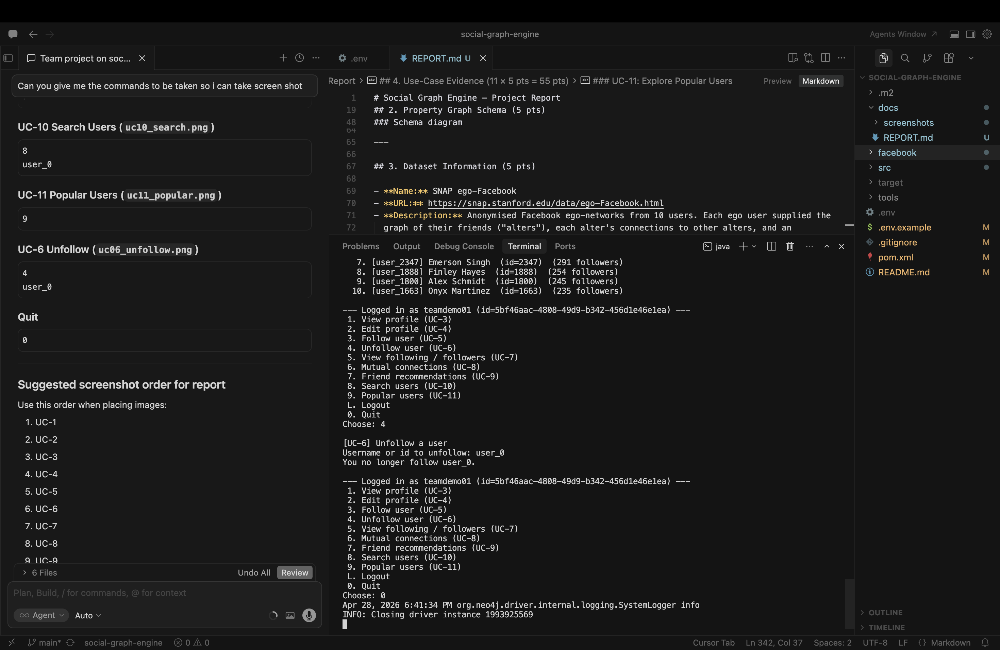

---

### UC-2: User Login

**Description**: Registered user logs in with username/password.

**Cypher** (hash retrieved, password verified in Java using BCrypt)

```cypher
MATCH (u:User {username: $username})
RETURN u.id AS id, u.passwordHash AS hash;
```

**Screenshot**

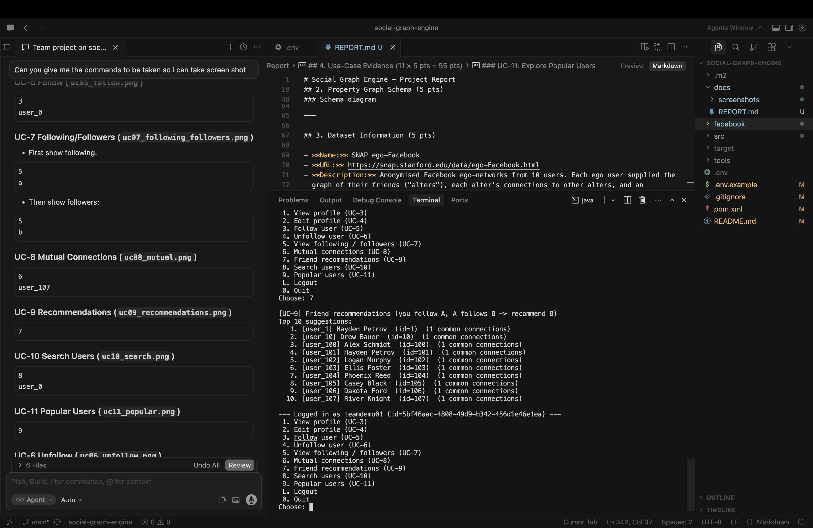

---

### UC-3: View Profile

**Description**: Logged-in user views own profile.

**Cypher**

```cypher
MATCH (u:User {id: $id})
RETURN u;
```

**Screenshot**

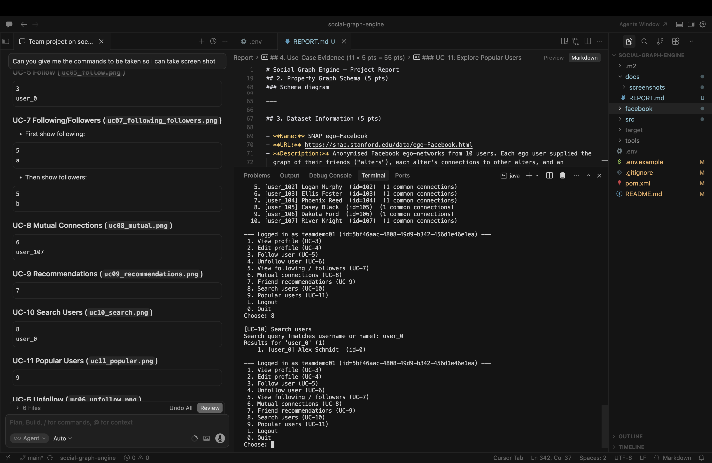

---

### UC-4: Edit Profile

**Description**: Logged-in user updates profile fields (name, bio).

**Cypher**

```cypher
MATCH (u:User {id: $id})
SET u.name = $name,
    u.bio = $bio
RETURN u;
```

**Screenshot**

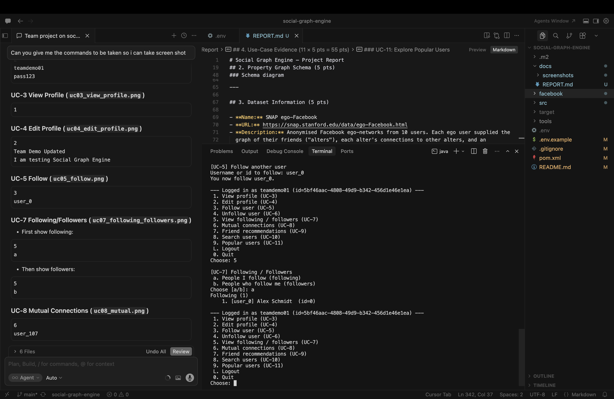

---

### UC-5: Follow Another User

**Description**: User follows another user, creating a directed edge.

**Cypher**

```cypher
MATCH (a:User {id: $me}), (b:User {id: $target})
MERGE (a)-[r:FOLLOWS]->(b)
  ON CREATE SET r.since = datetime()
RETURN r;
```

**Screenshot**

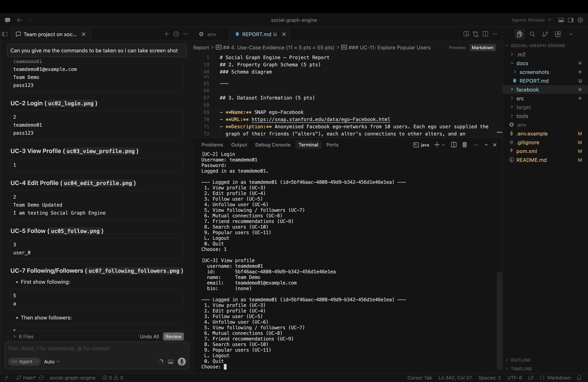

---

### UC-6: Unfollow a User

**Description**: User removes the follow relationship.

**Cypher**

```cypher
MATCH (:User {id: $me})-[r:FOLLOWS]->(:User {id: $target})
DELETE r;
```

**Screenshot**

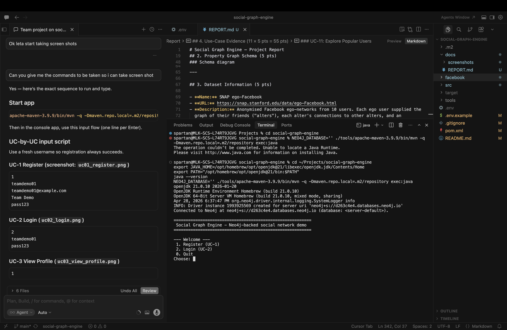

---

### UC-7: View Friends/Connections (Following and Followers separately)

**Description**: User can view outgoing follows (following) and incoming follows (followers) as two separate lists.

**Cypher (following)**

```cypher
MATCH (:User {id: $me})-[:FOLLOWS]->(u:User)
RETURN u
ORDER BY u.username;
```

**Cypher (followers)**

```cypher
MATCH (:User {id: $me})<-[:FOLLOWS]-(u:User)
RETURN u
ORDER BY u.username;
```

**Screenshot**

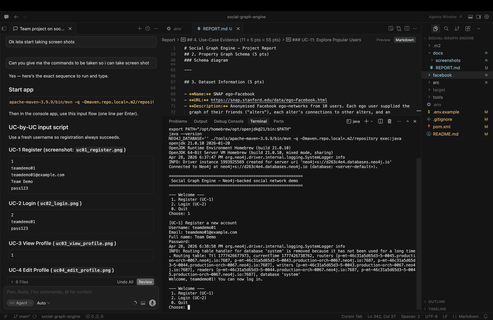

---

### UC-8: Mutual Connections

**Description**: Display users followed by both users (intersection of follow sets).

**Cypher**

```cypher
MATCH (:User {id: $me})-[:FOLLOWS]->(m:User)<-[:FOLLOWS]-(:User {id: $other})
RETURN DISTINCT m
ORDER BY m.username;
```

**Screenshot**

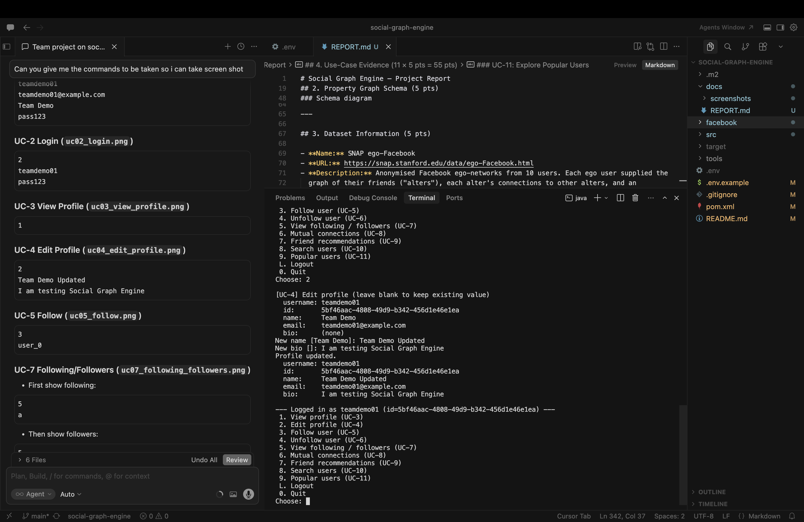

---

### UC-9: Friend Recommendations

**Description**: Recommend users based on two-hop traversal: user follows A, A follows B, and user does not already follow B.

**Cypher**

```cypher
MATCH (me:User {id: $me})-[:FOLLOWS]->(:User)-[:FOLLOWS]->(rec:User)
WHERE rec.id <> $me AND NOT (me)-[:FOLLOWS]->(rec)
WITH rec, count(*) AS commonConnections
RETURN rec, commonConnections
ORDER BY commonConnections DESC, rec.username ASC
LIMIT 10;
```

**Screenshot**

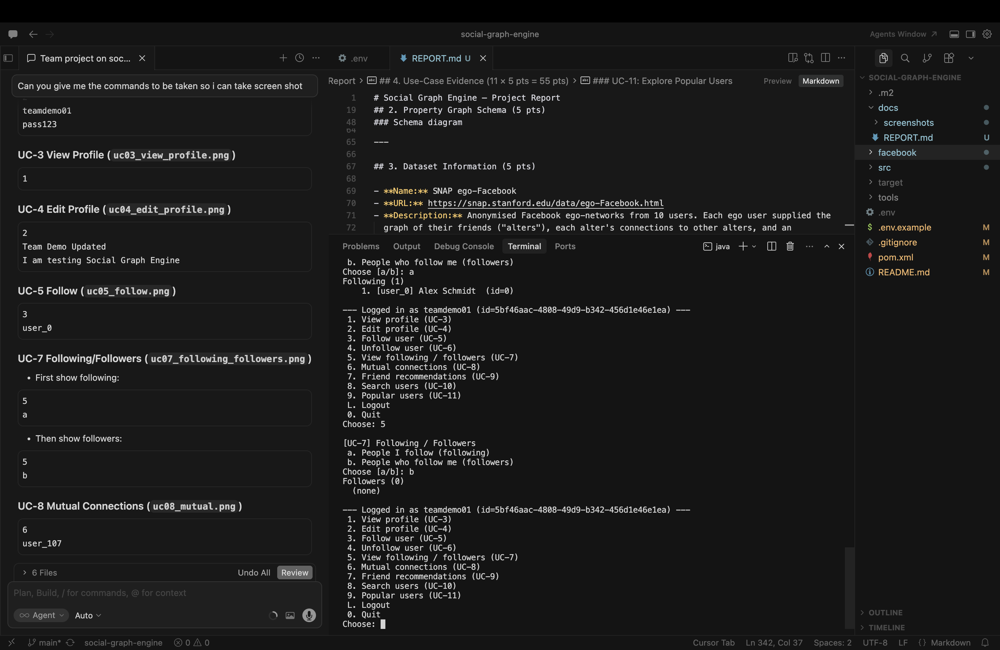

---

### UC-10: Search Users

**Description**: Search users by partial username or name match.

**Cypher**

```cypher
MATCH (u:User)
WHERE toLower(u.username) CONTAINS toLower($q)
   OR toLower(u.name) CONTAINS toLower($q)
RETURN u
ORDER BY u.username
LIMIT 20;
```

**Screenshot**

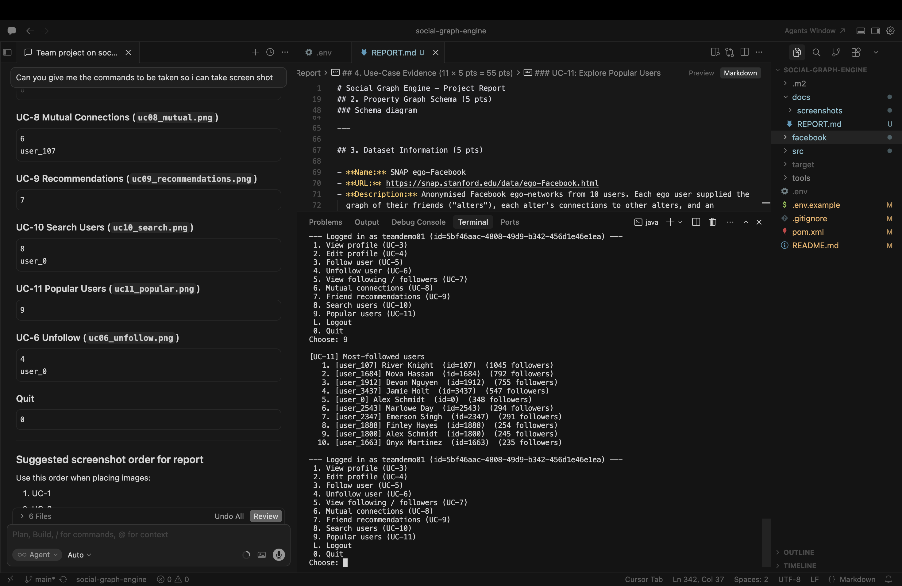

---

### UC-11: Explore Popular Users

**Description**: Return most-followed users using incoming degree.

**Cypher**

```cypher
MATCH (u:User)<-[:FOLLOWS]-()
WITH u, count(*) AS followers
RETURN u, followers
ORDER BY followers DESC, u.username ASC
LIMIT 10;
```

**Screenshot**

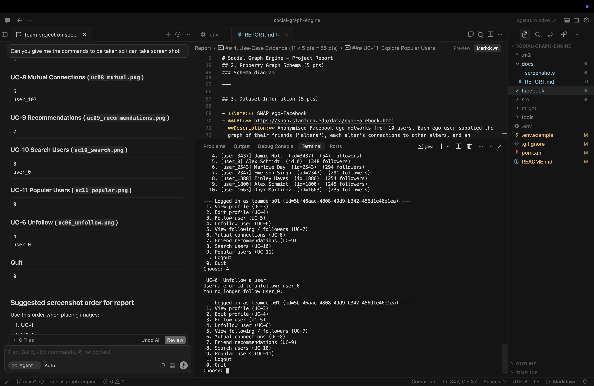

---

## 5. Build and Run Instructions (for reproducibility)

### 5.1 Environment configuration

Create `.env` from `.env.example`:

```dotenv
NEO4J_URI=neo4j+s://<your-instance>.databases.neo4j.io
NEO4J_USERNAME=<your-username>
NEO4J_PASSWORD=<your-password>
NEO4J_DATABASE=
```

Note: `NEO4J_DATABASE` can be left empty to use Aura server-default database.

### 5.2 Build

```bash
./tools/apache-maven-3.9.9/bin/mvn -q -Dmaven.repo.local=.m2/repository clean compile
```

### 5.3 Load dataset

```bash
NEO4J_DATABASE='' ./tools/apache-maven-3.9.9/bin/mvn -q -Dmaven.repo.local=.m2/repository exec:java -Dexec.args="--load --reset"
```

### 5.4 Run application

```bash
NEO4J_DATABASE='' ./tools/apache-maven-3.9.9/bin/mvn -q -Dmaven.repo.local=.m2/repository exec:java
```

---

## 6. Conclusion

This project delivers a complete social networking application using Java and Neo4j with a graph-driven feature set. The system successfully models user entities and social relationships, supports authentication and profile management, and demonstrates graph-native operations such as mutual connections, recommendation by traversal, search, and popularity ranking.

All 11 required use cases are implemented and demonstrated through the console interface. The selected dataset and final graph size satisfy and significantly exceed assignment minimum data-volume requirements.

---

## 7. Final Submission Checklist

- [ ] Team member names and emails are filled in Section 1.
- [ ] All 11 screenshots are present in `docs/screenshots/`.
- [ ] `report.pdf` is exported from this report.
- [ ] Source-code folder includes `pom.xml`, `src/`, `README.md`, `.env.example`, `docs/`, and dataset files as required.
- [ ] Real secret file `.env` is excluded from submission.
- [ ] Final upload file is `projects.zip` containing:
  - `report.pdf`
  - source-code folder
